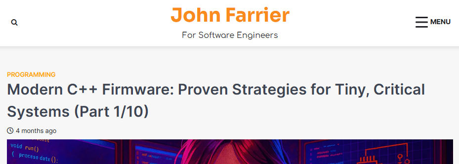

## Modern C++ for Embedded Systems - Rutvij Girish

- Core C++ Features
	- class/struct/union: data + functions + overloaded operators, private/protected encapsulation. POD aggregates work with direct list initialization
	- namespace, anonymous namespace (avoid name collisions, superior to static for file-local scope)
	- direct list initialization `A a{}` (prevents narrowing, no vexing parse)
	- constexpr (compile-time lookup tables, eg sine table via Taylor series)
	- static_assert (compile-time checks with diagnostic messages)
- STL & Utilities
	- **algorithms**: min/max, fill, copy, for_each, all_of (use freely on host, on target they inline). no hidden allocation
	- atomic, atomic_load/\_store (solves torn reads, instruction reording in ISRs. critical for ISR→main() communication)
	- alignas/alignof (control memory alignment, adds padding. use for DMA buffers)
	- std::span (C++20, non-owning bounds-safe view over contiguous memory. single function works on vector/array/C-array/raw buffer. no copies)
- Object Oriented
	- dynamic polimorphism (virtual): vtable per class + vptr per object (8 bytes on 64-bit, RTTI overhead, -fno-rtti strips typeid/dynamic_cast `if (typeid(Base) ** typeid(Derived))`. acceptable in HAL
	- non-copyable class (`= delete` copy/move ctor/assign. prevent accidental duplication of resource of hardware handle, mutex)
	- const member functions (promise no modification, callable on const objects `void f() const;`)
	- mutable: mutex (mutex, cache, instrumentation iinside const)
	- class friend: unit testing (unit testing, tightly coupled helper classes. weakens encapsulation - use sparingly & document why)
- Templates & Generic Programming
	- class templates, CTAD (C++17, deduce template args from constructor `Point<int> p(1,2) -> Point p(1,2)`)
	- static polimorphism (Duck Typing, CRTP) - no vtable, no runtime overhead, compile-time resolution
	- **variadic templates** (type safe unions: logger, sensor processor with arbitrary args)
	- TMP (compile time computation: factorial, loop unrolling, constant table generation, stored in .rodata/read only data in flash/ROM)
	- SFINAE + type traits (enable\_if, is_unsigned, is_integral, is_pointer - verbose cryptic errors)
	- concepts (C++20, direct replacement: clean syntax, replaces enable_if entirely, better error messages, `requires` clause. use for hardware platform contract, communication channel constraint)
- Optimization
	- compiler optimizations: -O2 (most optimizations, modest size), -O3 (+inlining, loop unrolling, larger code), -Os (size-first, best for flash-constrained). benchmark using CRC32
	- assembly listings (objdump -dS or gcc -S, follow src code line to generated opcode. **verify constexpr gets computed**, virtual calls didnt inline, critical loops are tight)
	- map files (see vtables locations, section sizes, linker output of symbol addresses, code size per class. **diff between builds to catch unexpected bloat**, reveal per class vtable presence)
	- name mangling (c++filt to demangle. Example: `_ZN8my_namespace3fooEi` → `my_namespace::foo(int)`)
	- linker scripts (define memory regions: flash, RAM, assign sections (.text, .data, .bss), set entry point for startup
	- **placement new** (construct object at pre-allocated address, no heap allocation. use with arena allocator, DMA buffers, shared memory. need to call destructor explicitly)
	- lambda expressions (compiler sees whole block → better register allocation, more inlining. consistent use can reduce size)
	- register access (memory mapped I/O): volatile pointer (prevent reordering/elimination), constexpr base address, read-modify-write with mask
- Startup
	- startup code: init CPU registers, power domains, BSS zero-init, copy .data from flash (LMA) to RAM (VMA), static constructors (iterate through .init_array/.ctors sections), then call `main()`
	- static initialization order fiasco → global static in file A, accesses idem in file B, order undefined, might access before construction and crash. **Meyers Singleton** (function-local static, constructed on first use, thread safe. prefer over global statics)
- Concurrency
	- **wrap RTOS** (FreeRTOS, Zephyr provides C APIs) with C++ RAII wrappers (eg: xTaskCreate in std::jthread. mutex wrappers, lock in ctor, unlock in dtor)
	- CRTP trampoline: C function pointer casts `void*` back to `this`, calls `run()` member function. bridges c style task functions to C++ object methods
	- `std::jthread` + `std::stop_token` if RTOS provides scheduler + C++ bindings. cooperative concellation buitl in
- Math
	- `<numbers>`: std::numberspi, sqrt2, ln2, e (C++20)
	- `std::complex<T>` (float/double/long double): arithmetic, transcendental functions, norm, polar
	- fixed-point (Q format): integer base + scaling fator (2^N), add/sub direct, multiply → scale back (right shift), divide → prescale numerator (left shift), use wider intermediate (`int128_t`) to prevent overflow. good for MCU without FPU.

## [Modern C++ Firmware - Proven Strategies for Tiny Critical Systems](https://johnfarrier.com/modern-cpp-firmware-part-01-case-for-modern-cpp/)

- Banned (no exceptions)
	- exceptions (stack unwinding unpredictable), RTTI/vtable/vptr (adds typeinfo structures), std::function (heap alloc for type erasure + capture, just use functors), iostream (alloc in formatting)
	- dynamic allocation in logic (optionally, only on startup. no malloc after init)
	- runtime polimorphism (no/minimize. prefer static polymorphism)
	- coroutines (heap allocation for frame)
- Allowed
	- TMP, concepts, traits, constraints, asserts (compile-time only, zero runtime cost)
	- smart pointers (unique_ptr w/ custom deleter). no shared_ptr (control block allocation, atomic refcount)
	- **constexpr, consteval, constinit** (guarantee static initialization, no order fiasco)
	- \<variant>, \<optional>, \<expected> (error report without exception)
	- \[\[maybe_unused]], \[\[nodiscard]], \[\[assume]]
	- for-range init `for(auto&x=init; auto&y : range)`
	- std::array, std::span, \<string_view> (fixed capacity, non owning, no allocation)
	- **std::chrono** (typesafe time), \<ranges> (sparingly, lazy evaluation may hide cost), algorithms (preferably on host tests)
	- std::jthread, std::stop_token (only if already supported by RTOS)
- Best Practices
	- **span** over ptr+len, chrono over raw ints, [[nodiscard]] if returns status/allocation
	- noexcept by default for better optimization, try_ prefix if operation may fail (try_push, try_parse)
	- prefer **.at(),** operator\[] (if proven bounds)
	- no allocation in control loop, fixed-capacity w/ overflow counters
	- core compiles on x86_64, **host tests + sanitizers** (ASAN, UBSAN) mandatory
	- CI enforces: -Werror, -fno-exceptions, -fno-rtti, flash/SRAM budgets eforced per MCU build variant (eg. **fail if headroom <5%**)
- Design & Patterns
	- RAII (non-negotiable. for mutex locks, DMA handles, GPIO pins)
	- **policy-based template**, duck-typing (compile-time polymorphism, zero overhead)
	- **arena allocator** (custom new from fixed pool, startup only allocation. no `free` to cause fragmentation)
- Firwmare Quality Metrics
	- crash-free hours (trend + delta after release. target 99.99% for critical systems)
	- OTA success rate + top failure reasons (network, storage, version mismatch, power loss)
	- unexpected reboot rate per reason (eg. watchdog, fault exception, power glitch)
	- MTTR for top issues (time to diagnose + time to fix)
	- number of hotfixes after release (trend)
- Tools
	- GCC/Clang (C++20/23), -Werror -fno-exceptions -fno-rtti
	- clang-tidy, clang-format, iwyu (include what you use). enforce in CI
	- CMake + Ninja, containerized toolchain (docker) for reproducibility. CMake presets for host/target/debug/release/iottest. Ninja for fast build.
	- GoogleTest (host), pytest (HIL with IoTest/GPIO test firmware): host unit tests + scenario tests
	- ASAN (buffer overflow), UBSAN (signed overflow), TSAN (for concurrency. host, optional, noisy)
	- gcov/lcov/llvm-cov: coverage reporting. Enforce threshold for core logic (start 80%, ratchet to 95%).
	- gnu size, nm, google bloaty, map file parser (custom) to enforce per-section limits (.text, .data, .bss). bloaty show size delta per symbol
	- GitLab CI (7 stages: lint, static, host-build, host test+coverage, sanitizers, target-build (all variants), size-gates)

## C++ in Embedded Systems - Amar
- writing c++ HAL
- working with c libs
- sequencer for super loops
	- \<TBD>
- pubsub pattern
- fsm
	- boost sml
	- pigweed
- portability & mocking
- \<TBD>

## Other References
- https://abougouffa.github.io/awesome-coding-standards/